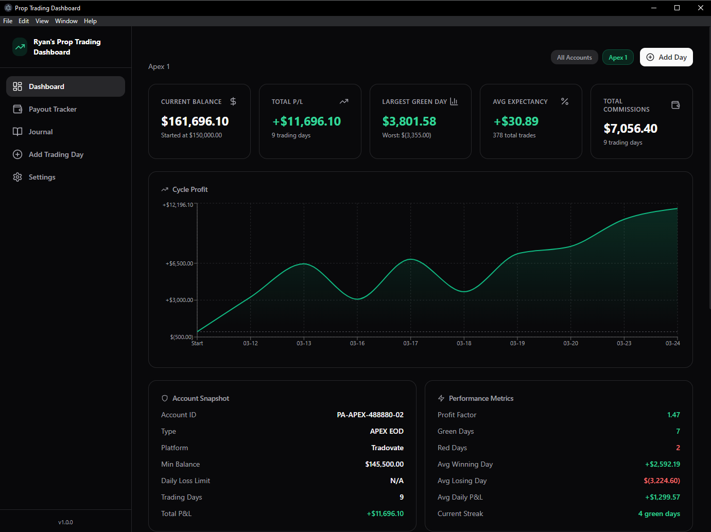
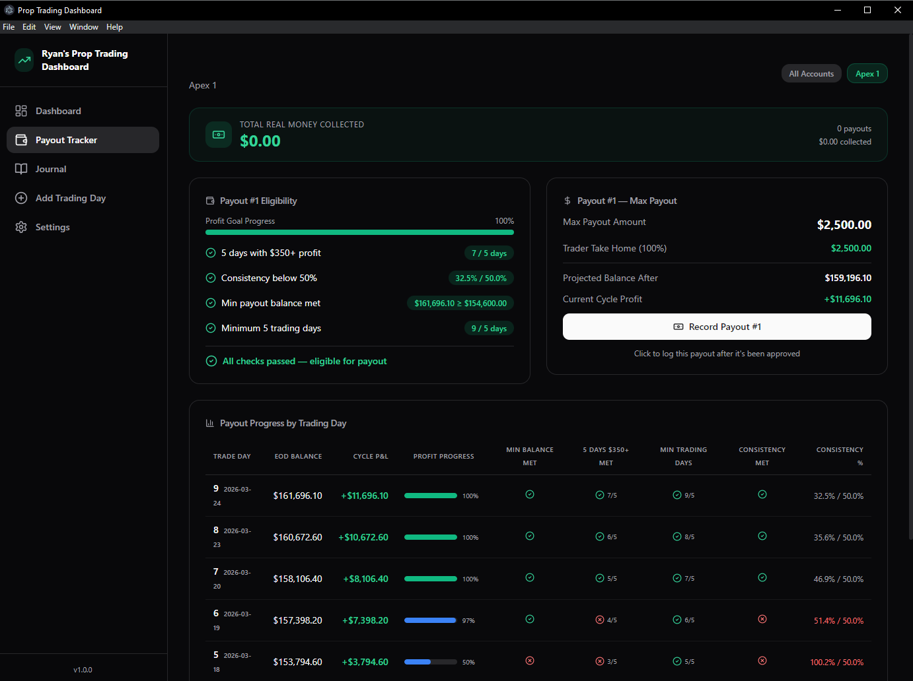
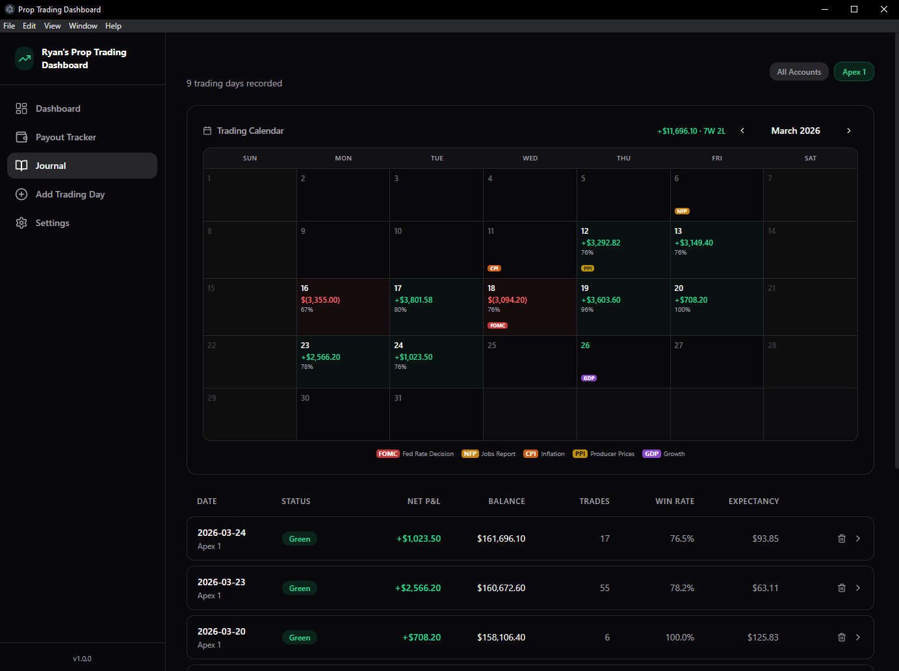
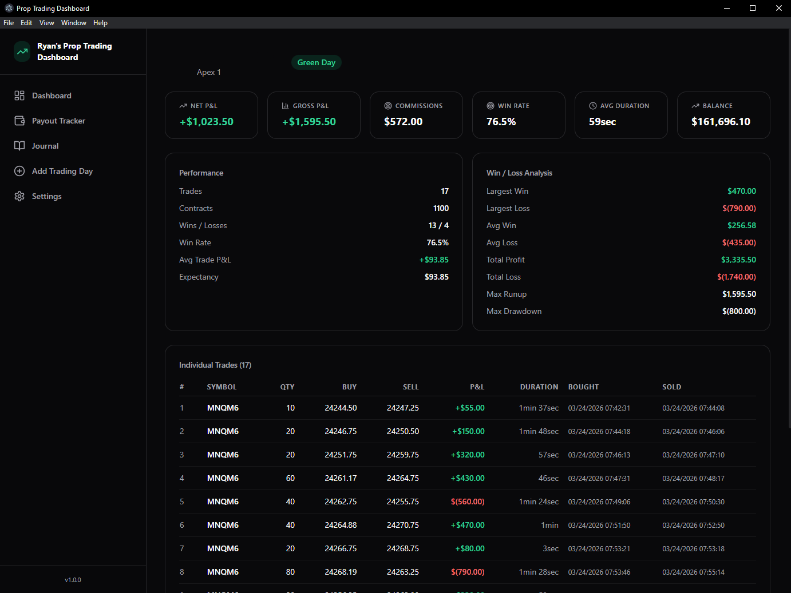
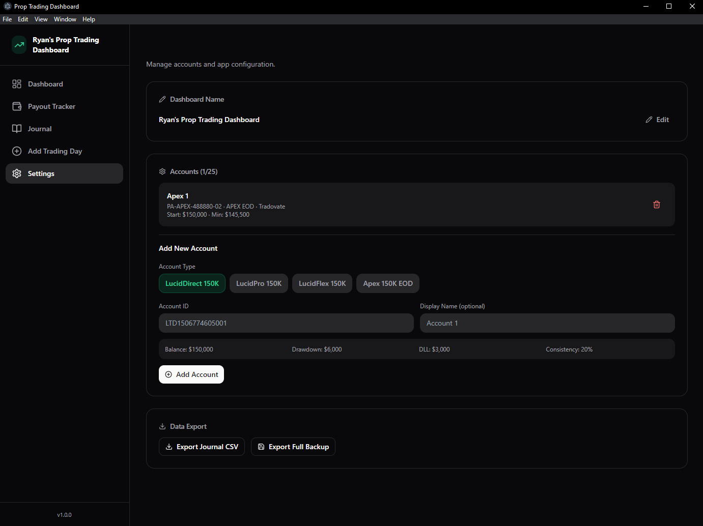

# Prop Trading Performance Dashboard

A desktop analytics platform for tracking, analyzing, and optimizing performance across multiple proprietary trading accounts. Built to solve a real problem — prop firms have strict payout rules (profit goals, consistency limits, drawdown thresholds) that vary by account type, and no existing tool consolidates it all into one view.

## Screenshots

### Dashboard
KPI cards, cycle profit curve, account snapshot, and performance metrics at a glance.



### Payout Tracker
Real-time eligibility checks against firm-specific rules — profit goals, consistency ratios, minimum profitable days, and balance thresholds. Includes a per-day progress table showing how eligibility evolved over time.



### Journal
Calendar view with daily P&L, win rates, and economic event markers (FOMC, NFP, CPI, etc.). Sortable day-by-day log below.



### Day Detail
Full breakdown of a single trading day — individual trades with entry/exit timestamps, durations, win/loss analysis, max runup, and max drawdown.



### Settings
Account management with firm-specific presets (LucidDirect, LucidPro, LucidFlex, Apex EOD), data export, and backup.



## What It Does

**Import a CSV of your daily trades → get instant statistical breakdowns, running P&L curves, and real-time payout eligibility tracking.**

The app ingests raw trade execution data (timestamps, fill prices, quantities) and builds a full analytics layer on top of it:

- **Trade Aggregation Pipeline** — Raw CSV fills are parsed, grouped by overlapping time intervals, and merged into logical trades. Split fills across the same position are automatically detected and consolidated using interval overlap analysis.
- **Per-Day Statistical Engine** — Each trading day is broken down into win rate, expectancy, profit factor, average trade duration, max intraday runup/drawdown (computed via cumulative P&L sequencing), and more.
- **Multi-Account Analytics** — Manage accounts across different prop firms (Apex, Lucid, etc.) with independent balance tracking, combined profit curves, and per-account breakdowns from a single dashboard.
- **Payout Eligibility Modeling** — Each firm has unique payout rules. The app models them as configurable rulesets — consistency ratios, minimum profitable days, balance thresholds, tiered payout caps — and evaluates eligibility in real time as new data comes in.
- **Balance & Profit Curves** — Interactive time-series charts showing cycle profit per account and combined, with per-account overlays for comparison.

## How It's Structured

```
electron/
  ├── database.ts        # SQLite layer (sql.js) — schema migrations, transactions, WAL mode
  ├── csv-parser.ts      # Trade CSV ingestion — fill aggregation, duration calc, summary stats
  ├── ipc-handlers.ts    # Electron IPC bridge between main process and renderer
  └── main.ts            # App entry, window management

src/
  ├── lib/
  │   ├── calculations.ts    # Core analytics — account stats, payout eligibility, combined stats
  │   ├── account-presets.ts  # Firm-specific rule configs (payout schedules, consistency limits)
  │   ├── types.ts            # Full type system — accounts, trades, days, computed stats
  │   └── utils.ts            # Formatting helpers
  ├── pages/
  │   ├── DashboardPage.tsx   # KPI cards, profit curves, performance metrics, streaks
  │   ├── PayoutPage.tsx      # Eligibility checklist, payout history, per-day progress table
  │   ├── JournalPage.tsx     # Trading calendar, day-by-day log
  │   ├── DayDetailPage.tsx   # Individual trade breakdown with win/loss analysis
  │   ├── AddDayPage.tsx      # CSV import flow
  │   └── SettingsPage.tsx    # Account management, data export/import
  └── components/
      ├── dashboard/BalanceCurve.tsx  # Multi-series area charts (Recharts)
      └── layout/                     # Sidebar, account switcher
```

## Key Analytics

| Metric | How It's Computed |
|---|---|
| **Expectancy** | `(winRate × avgWin) + ((1 - winRate) × avgLoss)` — expected value per trade |
| **Consistency Ratio** | `largestGreenDay / cycleProfit` — must stay below firm limit (e.g., 20%) |
| **Profit Factor** | `totalProfit / totalLoss` — ratio of gross gains to gross losses |
| **Max Drawdown** | Cumulative P&L peak-to-trough within a trading day |
| **Payout Eligibility** | Rule engine evaluating profit goals, consistency, min trading days, balance thresholds per firm |

## Tech

- **TypeScript** end-to-end (Electron main + React renderer)
- **SQLite** (sql.js/WASM) with migration system, transaction support, WAL journaling
- **React 18** with hooks-based state management
- **Recharts** for interactive time-series and bar chart visualizations
- **Tailwind CSS** + Radix UI primitives for the interface
- **Vite** + Electron for fast dev iteration and native desktop packaging

## Running Locally

```bash
npm install
npm run dev        # starts Vite + Electron in dev mode
npm run package    # builds a portable Windows executable
```

## Roadmap

### Expanded Firm Coverage
Currently supports LucidDirect, LucidPro, LucidFlex, and Apex EOD account types. The goal is to build a comprehensive ruleset library covering as many prop firms as possible — My Funded Futures, Topstep, Earn2Trade, The Trading Pit, and others — so a user can select something like a "MFF 50K Pro" account and have all payout rules, consistency limits, drawdown thresholds, and tiered withdrawal caps preconfigured automatically.

### Analytics Tab
A dedicated analytics view that surfaces patterns in the user's own trading data through algorithmic analysis (not AI). Planned insights include:

- **Optimal trading windows** — P&L distribution by time of day and day of week to identify when performance is strongest
- **Position sizing analysis** — Performance broken down by contract count to find the most profitable sizing
- **Trade duration profiling** — Win rate and expectancy segmented by hold time (scalps vs. longer trades)
- **Per-account-type comparison** — How performance differs across firm types and rule structures
- **Streak and drawdown patterns** — Identifying behavioral tendencies after consecutive wins or losses

### AI Tab
Two distinct features powered by an LLM (e.g., GPT-4) with full context over the user's trading data:

- **Automated Trade Analysis** — Generates an in-depth performance review based on the user's analytics data, highlighting strengths, weaknesses, and actionable suggestions for improving execution, risk management, and consistency
- **Conversational Assistant** — A chat interface where the user can ask questions about their trading history, stats, and patterns in natural language (e.g., "What's my win rate on Mondays?" or "How do I perform after a red day?")

## Why I Built This

I actively trade prop firm accounts and needed a way to track my performance against each firm's specific payout rules — consistency limits, tiered withdrawal caps, minimum profitable days, and more. Nothing on the market handled multiple firms with different rule structures in one place, so I built it myself. The data pipeline (CSV → parsed trades → aggregated stats → eligibility checks) mirrors the kind of ETL and analytics work I enjoy.
